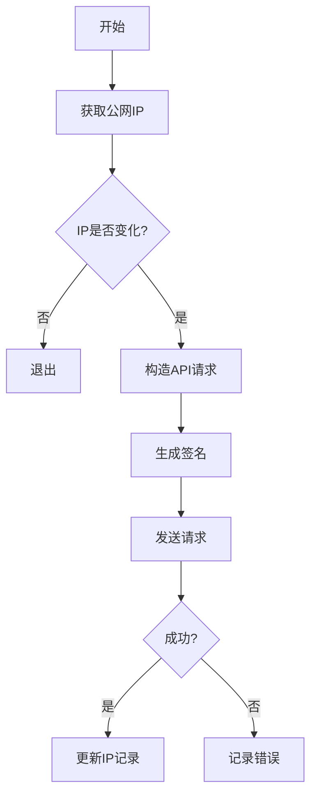

以下是规范的Markdown格式说明文档：

```markdown
# 阿里云RDS白名单自动更新脚本使用说明

## 📜 功能概述
本脚本用于自动检测服务器公网IP变动并更新阿里云RDS实例的白名单配置，主要特性包括：
✅ 多IP源冗余检测  
✅ 阿里云V3签名认证  
✅ IP变动智能判断  
✅ 完整的日志记录  
✅ 安全的密钥处理

## 🔧 配置说明

### 必要参数配置
```bash
# 身份验证
ACCESS_KEY_ID="LTAI5txxx"       # 阿里云AccessKey ID
ACCESS_KEY_SECRET="xxx"         # 阿里云AccessKey Secret

# 实例配置
REGION_ID="cn-shanghai"         # 地域ID
INSTANCE_ID="rm-uf6xxx"         # RDS实例ID
SECURITY_GROUP_NAME="default"   # 白名单分组名称

# 路径配置
IP_FILE="/tmp/last_ip.txt"      # IP记录文件
LOG_FILE="/tmp/rds_whitelist.log" # 日志文件
```

### 参数获取指南
1. **AccessKey**：通过[阿里云控制台](https://ram.console.aliyun.com/manage/ak)创建
2. **实例ID**：RDS控制台 -> 实例基本信息
3. **地域ID**：参考[地域列表文档](https://help.aliyun.com/document_detail/40654.html)

## 🚀 使用指南

### 快速开始
```bash
# 设置执行权限
chmod +x update_rds_whitelist.sh

# 手动运行
./update_rds_whitelist.sh

# 查看日志
tail -f /tmp/rds_whitelist.log
```

### 定时任务配置
```bash
# 每天凌晨1点执行
0 1 * * * /path/to/update_rds_whitelist.sh >> /var/log/rds_cron.log 2>&1

# 每30分钟检查一次（测试用）
*/30 * * * * /path/to/update_rds_whitelist.sh
```

## 🔍 实现细节

### 主要流程


### 关键技术点
1. **IP检测机制**：
   - 三级冗余检测：AmazonAWS/iPecho/Ifconfig.me
   - IPv4强制验证：`grep -oE "[0-9]{1,3}(\\.[0-9]{1,3}){3}"`
   
2. **阿里云签名V3**：
   ```python
   # 签名流程伪代码
   def sign_request(secret, params):
       canonical_query = sort_and_encode(params)
       hashed_payload = sha256("")
       string_to_sign = sha256(canonical_request)
       signature = hmac_sha256(secret, string_to_sign)
       return f"ACS3-HMAC-SHA256 Credential={key},Signature={signature}"
   ```

3. **安全增强**：
   - 密钥不落盘：通过环境变量传入
   - 最小化权限：建议使用仅包含RDS白名单管理权限的RAM账号

## ⚠️ 注意事项
1. **密钥安全**  
   🔐 切勿将AccessKey提交到版本控制系统  
   🔒 建议使用RAM子账号并授予最小权限

2. **IP源可靠性**  
   🌐 当所有检测源不可用时自动终止  
   ⏱ 内置5秒超时机制防止阻塞

3. **错误处理**  
   ❗ 保留最近10次日志循环覆盖  
   🔗 自动生成阿里云API调试链接

4. **网络要求**  
   📡 需开放443端口出站连接  
   ⚡ 依赖openssl/curl基础工具

## 📚 参考文档
- [阿里云RDS OpenAPI文档](https://next.api.aliyun.com/api/Rds/2014-08-15/ModifySecurityIps)
- [ACS签名机制说明](https://help.aliyun.com/document_detail/315526.html)
- [RAM权限策略配置指南](https://help.aliyun.com/document_detail/116401.html)
```

个人博客地址:https://urlzd.cn/t/huPvQfJ

建议保存为 `README.md` 与脚本文件放在同一目录，保持完整的版本更新记录和变更日志。该文档包含：
1. 结构化功能说明
2. 可视化流程图
3. 安全最佳实践
4. 排错指引
5. API参考链接
```
## 🚀 Star 趋势图

[](https://starchart.cc/714307168/update_rds_whitelist)
